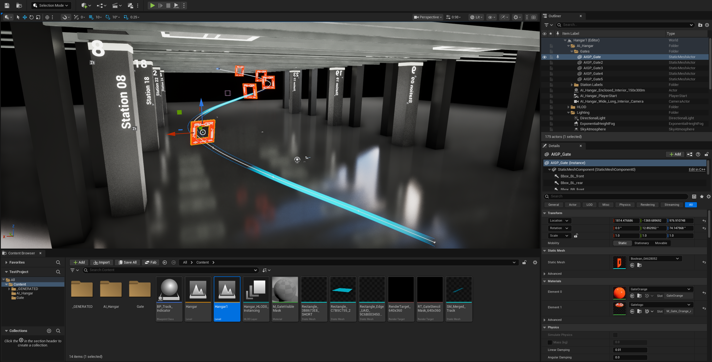

# Gate Dataset Automation



This project automates Unreal Engine dataset generation for gate detection and pose estimation, then provides model training, evaluation, inference, and a small local viewer for inspecting captured frames and predictions.

## Layout

- `src/dataset_generation/`: Unreal Editor automation for randomizing gate tracks, waiting for the rendered track to settle, and collecting image frames plus metadata.
- `src/dataset_generation/hangar_extraction/`: scripts and obstacle data for extracting hangar columns/pylons used during track placement.
- `src/models/`: training, evaluation, inference, tracking, and validation code for the gate detector.
- `src/app.py` and `src/ui/`: local browser viewer for datasets, evaluation artifacts, and validation runs.
- `datasets/`: generated datasets. Each generation execution creates `dataset_###/runs/run_###/...`.
- `artifacts/`: trained model checkpoints and evaluation outputs.
- `validation/`: annotated reference-frame validation runs.
- `docs/`: workflow notes and deeper implementation documentation.

This repository includes sample generated datasets and trained/evaluated model
artifacts so the viewer, evaluation code, and training pipeline have concrete
data to inspect before collecting new Unreal frames.

## Generation

Enable these Unreal plugins before running the generation scripts:

- Python Editor Script Plugin
- Editor Scripting Utilities

Restart Unreal Editor after enabling plugins. Then run the Unreal entrypoint
from the Python terminal in Unreal Editor:

```python
exec(open(r"C:\Users\brend\Projects\UE_5\TestProject\ML\SyntheticData\src\dataset_generation\generate.py").read())
```

You can also use `Tools > Execute Python Script` and select:

```text
C:\Users\brend\Projects\UE_5\TestProject\ML\SyntheticData\src\dataset_generation\generate.py
```

Generation settings live in `src/dataset_generation/config.py`. The generation runtime randomizes gates first, waits for the track to finish rendering or settle, then starts dataset collection.

The script loads `TARGET_LEVEL_PATH` from config (`/Game/Hangar1` by default)
when needed. It finds gate actors in the `Gates/` outliner folder, places them
along a generated race-track path, orients each gate toward the next gate, moves
the capture camera through randomized positions, syncs scene capture, saves
frames from `/Game/NewTextureRenderTarget640x360`, and writes corner
projections, bounding boxes, and relative camera-frame pose metadata.

New frames are written under:

```text
datasets/dataset_###/runs/run_###/frames/
```

Metadata is written to:

```text
datasets/dataset_###/runs/run_###/metadata.json
datasets/dataset_###/runs/run_###/metadata.jsonl
```

Watch the Unreal Output Log for script messages, warnings, and saved frame paths.

To use an LLM with Unreal, install the ModelContextProtocol plugins in the Unreal project, then run these commands in the Unreal command console:

```text
ModelContextProtocol.StartServer 8000
ModelContextProtocol.GenerateClientConfig Codex
```

Replace `Codex` with another LLM/client name when generating config for a different tool.

## Models

Model defaults live in `src/models/config.py`. The main training/evaluation pipeline is:

```powershell
.\SyntheticData\.venv\Scripts\python.exe -m SyntheticData.src.models.run_pipeline
```

Generated run names use nested identifiers such as `dataset_001/run_001`.

Use the project's virtual environment Python when training or evaluating. The
venv currently contains the CUDA-enabled PyTorch build, so activation is
optional as long as the venv interpreter is used directly:

```powershell
.\SyntheticData\.venv\Scripts\python.exe -m SyntheticData.src.models.training.train
```

The model device defaults to `auto`, which uses GPU/CUDA when
`torch.cuda.is_available()` is true and falls back to CPU otherwise. You can
force a device with `--device cuda` or `--device cpu`.

To confirm GPU availability before training:

```powershell
.\SyntheticData\.venv\Scripts\python.exe -c "import torch; print(torch.cuda.is_available()); print(torch.cuda.get_device_name(0) if torch.cuda.is_available() else 'CPU only')"
```

## Viewer

Start the local viewer with:

```powershell
python SyntheticData/src/app.py
```

Then open the printed local URL to inspect datasets, evaluation overlays, and validation outputs.
