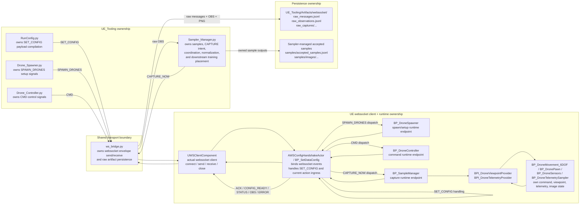

# WebSocket Data Contract (Working Draft)

Note: this document is currently a broad reference placeholder and should not be
read as proof that every described contract surface is fully implemented end to
end.

## Architecture Diagram



### Ownership Summary

Read this section top-to-bottom. `Server` is the Python tooling side. `Client` is the Unreal project side.

Server -> Client:

1. `RunConfig.py`, `Drone_Spawner.py`, `Drone_Controller.py`, and `Sampler_Manager.py` own server-side intent: config, spawn, command, and capture.
2. `protocol.py` owns the canonical wire envelope, message type tokens, and message build/parse helpers used to shape those messages.
3. `schemas.py` owns message validation and required-field enforcement on the server side.
4. `ws_bridge.py` owns the server-side websocket transport endpoint, outbound/inbound envelope movement, optional raw persistence, and the current server-side message handler.
5. `UWSClientComponent` owns the Unreal-side websocket transport pipe: connect, send, receive, close, and websocket event emission.
6. `AWSConfigHandshakeActor` and `BP_SetDataConfig` own the current Unreal-side message handler: websocket event binding, config gating, message ingress, and outbound reply emission.
7. `BP_DroneSpawner`, `BP_DroneController`, and `BP_SampleManager` are the Unreal IO endpoints that receive spawn, command, and capture intent.
8. `BP_DroneMovement_6DOF`, `BP_DronePawn`, `BP_DroneSensors`, and `BP_DroneTelemetrySampler`, together with `BPI_DroneCommandReceiver`, `BPI_DroneViewpointProvider`, and `BPI_DroneTelemetryProvider`, own the runtime command, viewpoint, telemetry, and image data used to satisfy those requests.

Client -> Server:

1. `BP_DronePawn`, `BP_DroneSensors`, and `BP_DroneTelemetrySampler` hold the live runtime state used to produce capture and status outputs. `BP_DronePawn` is the composition root only; it should host the movement, sensors, and telemetry modules as real Blueprint component templates and expose deterministic component-name discovery rather than direct command or sample behavior.
2. `BPI_DroneViewpointProvider` and `BPI_DroneTelemetryProvider` expose that runtime state to `BP_SampleManager`.
3. `BP_SampleManager`, `BP_DroneController`, `BP_DroneSpawner`, and `BP_SetDataConfig` generate the client-side application outputs: `OBS`, `STATUS`, `ACK`, `CONFIG_READY`, and `ERROR`.
4. `AWSConfigHandshakeActor` and `BP_SetDataConfig` own the current Unreal-side outbound message handling path back into the websocket client.
5. `UWSClientComponent` sends those outbound messages over the websocket back to the server.
6. `ws_bridge.py` receives them, validates them, routes them, tracks runtime state, and may persist raw transport artifacts when raw persistence is enabled.
7. `Sampler_Manager.py` is the sole tooling owner of returned sample validation, accepted sample placement, and downstream sample data.

### Systems That Touch The Data

| Side | System | Touches | Receives from | Sends or places to | Status |
| --- | --- | --- | --- | --- | --- |
| Tooling | `RunConfig.py` | config YAML, `config_id`, `config_hash`, compiled `SET_CONFIG` payload | YAML config files | `ws_bridge.py` startup config flow | `ACTIVE` |
| Tooling | `Drone_Spawner.py` | spawn/setup intent, requested `drone_id` set | run context | `ws_bridge.py` as `SPAWN_DRONES` | `LOOSE` |
| Tooling | `Drone_Controller.py` | control intent, per-drone command payloads | run context, `drone_id` | `ws_bridge.py` as `CMD` | `LOOSE` |
| Tooling | `Sampler_Manager.py` | owned sample lifecycle, capture intent, image validation, accepted sample persistence, downstream placement | run context, raw `OBS` | `ws_bridge.py` as `CAPTURE_NOW`; downstream training/storage locations | `LOOSE` |
| Transport | `ws_bridge.py` | full envelope, validation, gating state, optional raw messages, optional raw observations, raw PNG bytes | all tooling senders and Unreal websocket client | Unreal client over websocket; `UE_Tooling/Artifacts/websocket/<run_id>` | `ACTIVE` |
| Unreal client | `UWSClientComponent` | raw websocket text messages and connection state | `ws_bridge.py` | `AWSConfigHandshakeActor` event callbacks and outbound websocket sends | `ACTIVE` |
| Unreal ingress | `AWSConfigHandshakeActor` / `BP_SetDataConfig` | parsed inbound messages, config-ready state, current minimal spawn/cmd/capture handling | `UWSClientComponent` | `BP_SetDataConfig` state, `BP_DroneSpawner`, `BP_DroneController`, `BP_SampleManager`, outbound replies | `ACTIVE` |
| Unreal runtime | `BP_DroneSpawner` | spawn state, runtime drone IDs | websocket ingress actor | spawn results back to ingress actor as `STATUS` | `LOOSE` |
| Unreal runtime | `BP_DroneController` | command application state | websocket ingress actor | command status back to ingress actor as `STATUS` | `LOOSE` |
| Unreal runtime | `BP_SampleManager` | capture orchestration, atomic observation assembly | websocket ingress actor | pose/viewpoint/telemetry query calls and assembled `OBS` back to ingress actor | `LOOSE` |
| Unreal runtime | `BPI_DroneViewpointProvider` | viewpoint snapshot query surface | `BP_SampleManager` | viewpoint snapshot data | `LOOSE` |
| Unreal runtime | `BPI_DroneTelemetryProvider` | canonical top-level telemetry snapshot query surface bound to `ST_DroneTelemetrySnapshot` only | `BP_SampleManager` | telemetry snapshot data | `LOOSE` |
| Unreal runtime | `BP_DronePawn` / `BP_DroneSensors` / `BP_DroneTelemetrySampler` | composition-root state, live viewpoint state, live telemetry state, and image-producing state | provider interface calls and runtime simulation state | provider snapshots feeding `BP_SampleManager` | `LOOSE` |
| Persistence | `UE_Tooling/Artifacts/websocket/<run_id>` | raw transport records and decoded image captures | `ws_bridge.py` | offline review and future dataset import paths | `ACTIVE` |

## Purpose

This document is the working data contract for runtime traffic moving across:

- `UE_Tooling/Config`
- `UE_Tooling/WebSocket`
- `UE_Drone_Env/Plugins/DroneWebSocket`
- generated IO assets under `UE_Drone_Env/Content/io`
- generated drone-side structs and data assets under `UE_Drone_Env/Content/Drone_Content`

Its job is to do four things:

1. enumerate the fields currently moving across the WebSocket
2. separate what is actively defined from what is only loosely implied
3. identify the contract holes that must be resolved before the system can be treated as canonical
4. define one organized, predictable contract style so configs, commands, capture requests, observations, image payloads, pose data, telemetry data, and persisted artifacts all follow the same formatting and traceability expectations

The broader goal is to make the runtime contract extremely clear-cut and symmetric across all data families. Field naming, field placement, timestamps, IDs, nesting, and versioning should behave consistently so transport and storage are predictable whether the payload is a config, command, capture request, image, pose snapshot, telemetry snapshot, or observation record.

This is a working draft, not a claim that every described field is fully live today.

## Status Legend

- `ACTIVE`: enforced, emitted, or consumed by runtime code today
- `LOOSE`: documented, generated, or implied by metadata, but not strictly enforced end to end
- `OPEN`: ambiguous, conflicting, duplicated, or missing from one side of the transport

## Source-Of-Truth Precedence

When sources conflict, use this order:

1. `UE_Tooling/WebSocket/protocol.py`
2. `UE_Tooling/WebSocket/schemas.py`
3. `UE_Tooling/Config/RunConfig.py`
4. `UE_Drone_Env/Plugins/DroneWebSocket/Source/DroneWebSocket/*`
5. generator metadata in `UE_Tooling/UE_Build/Content_Generation/*`
6. `docs/ue_data_flows.md`

Important consequence:

- `docs/ue_data_flows.md` is useful as target-state intent, but it is not the live canonical contract when it disagrees with runtime code.

## Contract Design Rules

These rules should govern the canonical mapping going forward:

1. The envelope carries routing and traceability fields.
2. The payload carries domain data for that message type.
3. If a traceability field exists at the envelope level, it should not also be duplicated in payload unless there is a specific compatibility reason.
4. Aliases accepted by runtime code are compatibility behavior, not canonical field names.
5. `schema_version` must version the wire contract, not local YAML schemas.
6. Effective runtime config identity and source-config provenance are separate concerns and both must be retained.
7. `run_id`, `seq`, `message_id`, `config_id`, `config_hash`, `drone_id`, and `capture_id` should be sufficient to trace any stored observation back to its config and command context.

## Versioning And Config Provenance

This contract needs more than one kind of version tracking. Those version layers should not be collapsed together.

### Version Layers

| Layer | Purpose | Canonical owner | Example | Notes |
| --- | --- | --- | --- | --- |
| Wire contract version | versions the websocket message format | `payload` envelope `schema_version` | `1.0` | Changes when the websocket field contract changes |
| Effective runtime config identity | identifies the compiled config actually applied to the run | `payload.config_id`, `payload.config_hash` | `cfg_abcd1234...` | Changes when any effective runtime config value changes |
| YAML authoring schema version | versions the structure of a source YAML file | each YAML file's local `schema_version` | `0.1.0` | Changes when the authoring file format changes |
| YAML source content identity | identifies the exact source file content used for a run | per-source content hash | `<sha256>` | Needed to know exactly which source inputs produced a run |
| Config compiler identity | identifies the code path that compiled YAML into runtime config | compiler metadata | `RunConfig.py@1.0.0` | Needed because compile behavior can change even if YAML does not |
| Course environment provenance | identifies the generated course/map content used by the run | course generation artifact | `L_CourseTorus_v001_20260314_120000` | Needed because map layout and generated course assets affect runtime behavior |
| Drone content provenance | identifies the generated drone kit/assets/interfaces used by the run | drone content artifact | `DroneContentKit_v001_20260314_120000` | Needed because runtime pawn, sensors, telemetry, and interfaces may differ by generation run |
| IO wiring provenance | identifies the generated IO assets and map wiring used by the run | IO generation/wiring run metadata | `BP_SetDataConfig_Main` in `/Game/.../Maps/...` | Needed because websocket ingress and runtime IO endpoints depend on correct map wiring |

### Why This Separation Matters

`schema_version` inside websocket messages should only answer this question:

- can the sender and receiver interpret the same wire payload shape

It should not answer these different questions:

- which YAML file formats were used
- which exact YAML files were used
- which effective config values were actually applied
- which compiler logic transformed YAML into runtime config

If those are all collapsed into one version field, run traceability becomes ambiguous.

### Bootstrap Defaults Versus Applied Runtime Config

Generated Unreal data assets such as `DA_SensorRigProfileDefault` exist so generated content, editor startup, and headless runtime startup can initialize with a safe baseline before websocket config is applied.

Those asset values are bootstrap defaults only. They are not the source of truth for an executed run.

For a normal configured run, the authoritative sequence is:

1. Unreal starts with generated asset defaults present.
2. `RunConfig.py` compiles the authored YAML inputs into one `SET_CONFIG` payload.
3. `SET_CONFIG` is applied at runtime through the websocket handshake path.
4. The applied runtime config becomes the active run configuration that observations and artifacts must be traced against.

That means:

- generated asset defaults should be treated as startup safety and baseline initialization
- authored YAML plus `RunConfig.py` should be treated as the source of truth for the run's intended settings
- applied runtime config should be treated as the source of truth for capture validation, observation traceability, and artifact auditing
- asset defaults must not be used as a substitute for missing authored config on the tooling side

### What Must Be Traceable For A Run

For every run, the system should preserve all of the following:

1. the websocket wire `schema_version`
2. the effective config payload that was actually sent to Unreal
3. the resulting `config_id`
4. the resulting `config_hash`
5. the source YAML file paths used to produce that config
6. the local `schema_version` value from each YAML file
7. a content hash for each YAML file used
8. the config compiler identity and version
9. any compiler assumptions or defaults that were applied because source YAML omitted values
10. the course content generation identity for the map/environment used by the run
11. the drone content generation identity for the drone kit/assets used by the run
12. the IO generation and map wiring identity that made websocket ingress active in the target level
13. the exact target level path actually launched for the run

That is the minimum needed to answer both:

- what config did the runtime actually receive
- what authored source inputs and compiler rules produced that config

And for this repo, it is also needed to answer:

- what generated runtime environment was the run executed inside
- what generated drone and IO assets were active when messages were exchanged

### Additional Provenance Sources Beyond YAML

The current repo already has multiple provenance-producing build/runtime-prep scripts outside `RunConfig.py`.

#### Course environment provenance

`UE_Tooling/UE_Build/Content_Generation/Course/run_course_build.py` generates versioned course content and writes a run artifact under `UE_Tooling/Artifacts/runs`.

This provenance source currently captures:

- `course_name`
- `version_id`
- `timestamp`
- `run_name`
- generated Unreal asset directory and level path
- generator script metadata
- generated file existence checks

This is not websocket payload provenance, but it is run-environment provenance and should be tied to any runtime websocket session that uses the generated map.

#### Drone content provenance

`UE_Tooling/UE_Build/Content_Generation/Drone/run_drone_build.py` generates the drone content kit and writes a run artifact under `UE_Tooling/Artifacts/drone_content`.

This provenance source currently captures:

- `kit_name`
- `version_id`
- `timestamp`
- `run_name`
- ordered generator list
- per-generator script metadata
- per-generator logs, results, and return codes
- the embedded `SET_CONFIG` v1 field contract summary used by the drone content generation pipeline

This matters because the runtime pawn, interfaces, schema metadata, and capture-related blueprint defaults can all change across content-generation runs.

#### IO generation and map-wiring provenance

`UE_Tooling/UE_Build/Content_Generation/IO/run_io_build.py` establishes whether websocket ingress is actually present in the target map by generating the IO assets and then placing `BP_SetDataConfig` deterministically into the target level.

This provenance source now writes a run artifact under `UE_Tooling/Artifacts/io_build`.

This provenance source currently captures:

- `kit_name`
- `version_id`
- `timestamp`
- `run_name`
- target level path
- ordered IO script list
- per-script metadata, execution status, and timing
- `BP_SetDataConfig` asset identity
- deterministic actor label `BP_SetDataConfig_Main`
- placement result including `created` vs `reused`
- whether the target map was successfully saved after placement

This is critical provenance because a run can have the correct wire contract and config payload but still fail to behave the same way if the level was wired against a different IO asset set or not wired at all.

### Canonical Runtime Artifact Location

The current repo stores related artifacts in multiple places under `UE_Tooling/Artifacts/*`. That is workable during active development, but it is not the cleanest long-term provenance layout.

Target-state recommendation:

- use one repo-root runtime artifact root: `artifacts/runs/<run_id>/`
- make that parent runtime run directory the canonical home for all assets, records, and provenance needed to understand that run
- preserve original child generation run names inside metadata, but do not require users to hunt across multiple artifact roots to reconstruct one runtime session

Recommended target-state shape:

```text
artifacts/
  runs/
    <run_id>/
      manifest.json
      config/
        set_config.json
        config_provenance.json
        source_yamls/
          SensorRigProfileConfig_Pose.yaml
          SensorRigProfileConfig_Viewpoint.yaml
          SensorRigProfileConfig_Telemetry.yaml
          Config_DroneMovementTuning.yaml
      environment/
        course_content.json
        drone_content.json
        io_wiring.json
      websocket/
        messages.jsonl
        observations.jsonl
        summary.json
        captures/
          *.png
      logs/
        course_generation.log
        drone_content_generation.log
        io_wiring.log
```

Expected meaning of each child area:

- `manifest.json`: parent run index that ties together the full provenance chain
- `config/`: the effective runtime config plus source-config provenance and YAML snapshots
- `environment/`: the course, drone-content, and IO wiring artifacts used by that run
- `websocket/`: raw transport records and decoded captures for the runtime session
- `logs/`: optional copied or linked logs that support debugging or audit

This layout is better because it gives one authoritative answer to:

- what run was executed
- what environment it was executed in
- what config it used
- what websocket traffic occurred
- what images and observations were produced

### Current-State Versus Target-State Artifact Layout

Current repo state is fragmented:

- course generation artifacts: `UE_Tooling/Artifacts/runs`
- drone content artifacts: `UE_Tooling/Artifacts/drone_content`
- IO build artifacts: `UE_Tooling/Artifacts/io_build`
- websocket runtime artifacts: `UE_Tooling/Artifacts/websocket/<run_id>`
- websocket build artifacts: `UE_Tooling/Artifacts/websocket_build`

Target-state should converge on:

- runtime run root: `artifacts/runs/<run_id>/`

And inside that run root:

- course provenance should appear under `environment/course_content.json`
- drone-content provenance should appear under `environment/drone_content.json`
- IO wiring provenance should appear under `environment/io_wiring.json`
- websocket transport artifacts should appear under `websocket/`

The important review point is this:

- yes, a repo-root `artifacts/runs/<run_id>/` layout is the right direction
- but child generation runs should still keep their own `run_name`, `version_id`, and source metadata inside the copied or embedded provenance records
- the parent runtime run folder should be the index and collection point, not a place that erases child provenance identities

### Current Repo Status

Today, `RunConfig.py` already returns some of this provenance out-of-band:

- `CompiledConfig.envelope`
- `CompiledConfig.assumptions`
- `CompiledConfig.source_paths`

And the YAML files themselves each carry their own local `schema_version` field.

What is still missing is a canonical, persisted provenance block that ties all of that together per run. In other words:

- the effective runtime config identity exists
- the source file references partly exist
- the source file versions exist inside YAML
- course generation artifacts exist
- drone content generation artifacts exist
- IO wiring intent exists, but structured artifactization is weaker there
- but the full provenance chain is not yet standardized as one canonical run record

### Recommended Canonical Provenance Block

The cleanest approach is to carry a source-provenance block alongside `SET_CONFIG` and persist the same block in bridge artifacts.

Recommended shape:

```json
{
  "config_id": "cfg_abc123...",
  "config_hash": "abc123...",
  "config_provenance": {
    "compiler": {
      "name": "RunConfig.py",
      "version": "1.0.0"
    },
    "source_files": {
      "pose_yaml": {
        "path": "UE_Tooling/Config/Data_Interface_Config/SensorRigProfileConfig_Pose.yaml",
        "schema_version": "0.1.0",
        "content_hash": "<sha256>"
      },
      "viewpoint_yaml": {
        "path": "UE_Tooling/Config/Data_Interface_Config/SensorRigProfileConfig_Viewpoint.yaml",
        "schema_version": "0.1.0",
        "content_hash": "<sha256>"
      },
      "telemetry_yaml": {
        "path": "UE_Tooling/Config/Data_Interface_Config/SensorRigProfileConfig_Telemetry.yaml",
        "schema_version": "0.1.0",
        "content_hash": "<sha256>"
      },
      "movement_yaml": {
        "path": "UE_Tooling/Config/Drone_Controller_Config/Config_DroneMovementTuning.yaml",
        "schema_version": "0.1.0",
        "content_hash": "<sha256>"
      }
    },
    "assumptions": [
      "movement.max_pitch_degps defaulted to 60.0"
    ]
  },
  "environment_provenance": {
    "course_content": {
      "artifact_run_name": "L_CourseTorus_v001_20260314_120000",
      "course_name": "L_CourseTorus",
      "version_id": "v001",
      "level_path": "/Game/Course_Content/L_CourseTorus_v001_20260314_120000/Maps/L_CourseTorus",
      "artifact_path": "artifacts/runs/<run_id>/environment/course_content.json"
    },
    "drone_content": {
      "artifact_run_name": "DroneContentKit_v001_20260314_120000",
      "kit_name": "DroneContentKit",
      "version_id": "v001",
      "artifact_path": "artifacts/runs/<run_id>/environment/drone_content.json"
    },
    "io_wiring": {
      "target_level": "/Game/Course_Content/L_CourseTorus_v001_20260314_120000/Maps/L_CourseTorus",
      "bp_setdataconfig_asset_path": "/Game/io/Data_Config/BP_SetDataConfig",
      "actor_label": "BP_SetDataConfig_Main",
      "artifact_path": "artifacts/runs/<run_id>/environment/io_wiring.json",
      "wiring_script": {
        "name": "run_io_build.py",
        "version": "1.3.0"
      }
    }
  }
}
```

This provenance block does not replace the effective config values. It complements them.

### Canonical Rule

Use these meanings consistently:

- `schema_version` = websocket wire contract version
- `config_id` and `config_hash` = effective runtime config identity
- `config_provenance.source_files.*.schema_version` = source YAML schema version
- `config_provenance.source_files.*.content_hash` = exact authored source identity
- `config_provenance.compiler.*` = compiler identity
- `environment_provenance.course_content.*` = generated map/environment identity
- `environment_provenance.drone_content.*` = generated drone asset/interface identity
- `environment_provenance.io_wiring.*` = generated IO asset and map-wiring identity

That separation is what makes runs auditable and reproducible.

## Overall Repo Status

Current repo state is a mixed maturity model:

- A live minimal handshake exists for `SET_CONFIG -> ACK -> CONFIG_READY`.
- A live minimal action loop exists for `SPAWN_DRONES`, `CMD`, and `CAPTURE_NOW`.
- A live minimal `OBS` message exists and is persisted by the bridge.
- The generated Unreal struct and asset metadata define a richer intended contract than the live WebSocket payloads currently carry.
- `docs/ue_data_flows.md` describes a broader target-state runtime than the plugin currently implements.

In short: the transport loop exists, but the contract is split across Python, C++, Unreal generators, and draft docs, with several naming and placement mismatches.

## Tooling Signal Ownership

The data contract is not only about field shape. It is also about which tooling surface is expected to originate or consume each message class.

These tooling modules are currently scaffolded, but they still matter because they establish intended ownership boundaries for runtime IO:

| Tooling surface | Role | Message ownership | Status |
| --- | --- | --- | --- |
| `UE_Tooling/Config/RunConfig.py` | config compiler | originates `SET_CONFIG` payload shape | `ACTIVE` |
| `UE_Tooling/Drone_Controller/Drone_Spawner.py` | setup/spawn initiator | should send `SPAWN_DRONES` and future reset/setup signals | `LOOSE` |
| `UE_Tooling/Drone_Controller/Drone_Controller.py` | control initiator | should send `CMD` and future higher-level control signals | `LOOSE` |
| `UE_Tooling/Data_Interface/Sampler_Manager.py` | sample owner and capture orchestrator | should send `CAPTURE_NOW`, receive `OBS` and capture-related `STATUS`, and own run/capture lifecycle plus downstream sample placement | `LOOSE` |
| `UE_Tooling/WebSocket/ws_bridge.py` | transport and persistence boundary | sends outbound envelopes, receives inbound envelopes, persists messages and observations | `ACTIVE` |

`Sampler.py` is intentionally excluded from the canonical contract model and has been removed from the tooling-side sampling path. Sampling ownership is fully collapsed into `Sampler_Manager.py`.

### Tooling-Initiated Signal Matrix

This is the intended tooling-side ownership model implied by the current repo shape.

| Message type | Primary tooling origin | Primary tooling consumer | Notes |
| --- | --- | --- | --- |
| `SET_CONFIG` | `RunConfig.py` via bridge startup flow | `ws_bridge.py` state machine | Live and enforced today |
| `SPAWN_DRONES` | `Drone_Spawner.py` | `ws_bridge.py` and downstream runtime status handling | Ownership is clear even though sender implementation is still scaffolded |
| `CMD` | `Drone_Controller.py` | `ws_bridge.py` and downstream runtime status handling | Ownership is clear even though sender implementation is still scaffolded |
| `CAPTURE_NOW` | `Sampler_Manager.py` | `ws_bridge.py` and downstream runtime observation handling | Capture ownership belongs with data interface, not controller |
| `OBS` | UE runtime | `Sampler_Manager.py`, persisted by `ws_bridge.py` | Bridge persists raw payload; `Sampler_Manager.py` owns normalization and downstream placement |
| `STATUS` | UE runtime | controller/spawner/sampler tooling depending on event | Event routing is not canonical yet |
| `ERROR` | UE runtime | bridge first, then owning tooling surface | Error ownership needs more explicit routing policy |

### Why This Matters For The Contract

Without these tooling ownership boundaries, the contract looks like a pure transport spec. That is incomplete.

The repo is actually expressing three separate but connected contracts:

1. wire shape
2. sender and consumer ownership
3. persistence and replay traceability

The sender ownership split is especially important for:

- deciding which fields are required for control versus capture flows
- deciding which `STATUS` events belong to controller flows versus sampler flows
- guaranteeing `run_id`, `drone_id`, `capture_id`, `config_id`, and command/capture sequencing remain aligned across control and data collection

## Canonical Envelope Inventory

All messages are wrapped in one JSON envelope.

### Envelope Fields

| Field | Type | Status | Canonical rule | Notes |
| --- | --- | --- | --- | --- |
| `type` | `string` | `ACTIVE` | required on all messages | Uppercase canonical tokens in `protocol.py` |
| `run_id` | `string` | `ACTIVE` | required on all messages | Primary run trace key |
| `schema_version` | `string` | `ACTIVE` | required on all messages | Current wire version is `1.0` |
| `seq` | `int` | `ACTIVE` | should be present on all messages | Live builders emit it; strict schema only requires it for some paths today |
| `timestamp` | `string` | `ACTIVE` | should be present on all messages | Envelope timestamp in ISO-8601 UTC |
| `message_id` | `string` | `ACTIVE` | should be present on all messages | Built by Python and UE envelope helpers |
| `payload` | `object` | `ACTIVE` | required on all messages | Domain data block |
| `drone_id` | `string` | `ACTIVE` | top-level on drone-specific messages | Required today for `CMD`, `CAPTURE_NOW`, `OBS` |
| `capture_id` | `string` | `ACTIVE` | top-level on capture-specific messages | Required today for `CAPTURE_NOW` and `OBS` in strict schema |
| `config_id` | `string` | `OPEN` | should be top-level when config-specific | Python envelope supports it; UE plugin envelope does not expose it |
| `config_hash` | `string` | `OPEN` | should be top-level when config-specific | Same gap as `config_id` |
| `in_reply_to` | `string` | `OPEN` | should be top-level on reply messages | Python supports it; UE plugin envelope does not expose it |

### Canonical Message Types

These are defined in `protocol.py`:

- `SET_CONFIG`
- `ACK`
- `ACK_RECEIVED`
- `CONFIG_READY`
- `ACK_APPLIED`
- `SPAWN_DRONES`
- `CMD`
- `CAPTURE_NOW`
- `OBS`
- `STATUS`
- `ERROR`

### Envelope Gaps

| Gap | Status | Detail |
| --- | --- | --- |
| UE envelope struct missing fields | `OPEN` | `FWSBridgeEnvelope` currently exposes `type`, `run_id`, `schema_version`, `seq`, `timestamp`, `drone_id`, `capture_id`, `message_id`, `payload_json`, but not `config_id`, `config_hash`, or `in_reply_to` |
| Timestamp naming split | `OPEN` | Envelope uses `timestamp`, while drone-side intended structs use `timestamp_utc` |
| Duplicate traceability fields | `OPEN` | Live `OBS` payload duplicates `run_id`, `drone_id`, and `capture_id` inside payload even though they already exist at the envelope level |

## Message Catalog

### `SET_CONFIG`

Direction:

- Tooling -> Unreal

Purpose:

- establish runtime movement, sensor-rig, and telemetry settings for the active run
- gate all downstream actions until config is accepted and ready

#### `SET_CONFIG` Envelope And Payload Fields

| Path | Type | Status | Required today | Notes |
| --- | --- | --- | --- | --- |
| `type` | `string` | `ACTIVE` | yes | Must be `SET_CONFIG` |
| `run_id` | `string` | `ACTIVE` | yes | Run context |
| `schema_version` | `string` | `ACTIVE` | yes | Current `1.0` |
| `seq` | `int` | `ACTIVE` | yes | Strictly required for `SET_CONFIG` |
| `timestamp` | `string` | `ACTIVE` | yes | Envelope timestamp |
| `message_id` | `string` | `ACTIVE` | no | Emitted by builders, not strictly validated |
| `payload.config_id` | `string` | `ACTIVE` | yes | Deterministic ID derived from config hash |
| `payload.config_hash` | `string` | `ACTIVE` | yes | SHA-256 over canonical config payload |
| `payload.config_provenance` | `object` | `OPEN` | no | Recommended canonical source-provenance block for YAML versions, source hashes, compiler identity, and assumptions |
| `payload.movement.max_speed_cmps` | `number` | `ACTIVE` | yes | Compiled from YAML or defaulted |
| `payload.movement.max_accel_cmps2` | `number` | `ACTIVE` | yes | Compiled from YAML or defaulted |
| `payload.movement.max_yaw_degps` | `number` | `ACTIVE` | yes | Compiled from YAML or defaulted |
| `payload.movement.max_pitch_degps` | `number` | `ACTIVE` | yes | Often defaulted because YAML does not expose it yet |
| `payload.movement.max_roll_degps` | `number` | `ACTIVE` | yes | Often defaulted because YAML does not expose it yet |
| `payload.movement.damping` | `number` | `ACTIVE` | yes | Compiled from YAML or defaulted |
| `payload.sensor_rig.active_viewpoint` | `string` | `ACTIVE` | yes | Current compiler collapses viewpoint list to one active viewpoint |
| `payload.sensor_rig.front_fov_deg` | `number` | `ACTIVE` | yes | FOV for active front viewpoint |
| `payload.sensor_rig.capture_width` | `int` | `ACTIVE` | yes | Width in pixels |
| `payload.sensor_rig.capture_height` | `int` | `ACTIVE` | yes | Height in pixels |
| `payload.sensor_rig.front_offset_cm.x` | `number` | `ACTIVE` | yes | Sourced from pose YAML today |
| `payload.sensor_rig.front_offset_cm.y` | `number` | `ACTIVE` | yes | Sourced from pose YAML today |
| `payload.sensor_rig.front_offset_cm.z` | `number` | `ACTIVE` | yes | Sourced from pose YAML today |
| `payload.telemetry.include_all_visible_meshes` | `bool` | `ACTIVE` | yes | Compiler default exists even if YAML does not define it |
| `payload.telemetry.distance_units` | `string` | `ACTIVE` | yes | Current default `cm` |
| `payload.telemetry.distance_precision_decimals` | `int` | `ACTIVE` | yes | Current default `3` |
| `payload.telemetry.center_distance_mode` | `string` | `ACTIVE` | yes | Current default `pivot_origin` |
| `payload.telemetry.edge_distance_mode` | `string` | `ACTIVE` | yes | Current default `nearest_triangle_edge` |
| `payload.telemetry.line_of_sight_filtering` | `bool` | `ACTIVE` | yes | Current default `False` |

#### `SET_CONFIG` Notes

- The live contract uses `sensor_rig`, not `sensors`.
- The live contract uses `max_speed_cmps`, `max_yaw_degps`, and similar fully qualified names, not `max_speed` or `yaw_rate_limit`.
- `RunConfig.py` is currently the canonical field compiler for this message.
- The effective config payload and the source-config provenance should both be preserved for a run. `config_id` and `config_hash` tell you what runtime config was applied; `config_provenance` tells you which YAML files and compiler inputs produced it.
- `docs/ue_data_flows.md` uses older or future-state names and should not be treated as canonical for this message.

#### `SET_CONFIG` Open Issues

| Issue | Status | Detail |
| --- | --- | --- |
| top-level config trace fields missing in UE envelope | `OPEN` | Python envelope supports top-level `config_id` and `config_hash`, but UE helper struct does not |
| YAML coverage is incomplete | `OPEN` | pitch and roll rate limits are required by wire contract but absent from movement YAML |
| source provenance is not canonical yet | `OPEN` | `RunConfig.py` exposes source paths and assumptions out-of-band, but per-run YAML schema versions, file hashes, and compiler identity are not yet standardized as `config_provenance` |
| sensor offset source is semantically awkward | `OPEN` | `front_offset_cm.*` is currently sourced from `SensorRigProfileConfig_Pose.yaml`, which is named like a pose capture config, not a rig geometry config |

### `ACK`

Direction:

- Unreal -> Tooling

Purpose:

- acknowledge receipt of `SET_CONFIG`

#### `ACK` Fields

| Path | Type | Status | Required today | Notes |
| --- | --- | --- | --- | --- |
| `type` | `string` | `ACTIVE` | yes | `ACK` |
| `run_id` | `string` | `ACTIVE` | yes | Run context |
| `schema_version` | `string` | `ACTIVE` | yes | Current `1.0` |
| `timestamp` | `string` | `ACTIVE` | yes | Envelope timestamp |
| `message_id` | `string` | `ACTIVE` | no | Emitted by UE helper |
| `payload.received` | `bool` | `ACTIVE` | no | Live plugin emits `true` |
| `payload.source` | `string` | `ACTIVE` | no | Live plugin emits `BP_SetDataConfig` |

#### `ACK` Open Issues

| Issue | Status | Detail |
| --- | --- | --- |
| no reply linkage | `OPEN` | `in_reply_to` is not emitted today |
| minimal payload only | `OPEN` | no stable `ack_stage`, `status`, or `config_ref` block exists yet |

### `ACK_RECEIVED`

Direction:

- Unreal -> Tooling or reserved

Status:

- `LOOSE`

Notes:

- Defined in Python protocol constants.
- Not emitted by the current UE plugin implementation.
- Should be treated as reserved until one side actually uses it.

### `CONFIG_READY`

Direction:

- Unreal -> Tooling

Purpose:

- confirm config was accepted and is ready for gated actions

#### `CONFIG_READY` Fields

| Path | Type | Status | Required today | Notes |
| --- | --- | --- | --- | --- |
| `type` | `string` | `ACTIVE` | yes | `CONFIG_READY` |
| `run_id` | `string` | `ACTIVE` | yes | Run context |
| `schema_version` | `string` | `ACTIVE` | yes | Current `1.0` |
| `timestamp` | `string` | `ACTIVE` | yes | Envelope timestamp |
| `message_id` | `string` | `ACTIVE` | no | Emitted by UE helper |
| `payload.config_id` | `string` | `ACTIVE` | yes | Echo of accepted config ID |
| `payload.config_hash` | `string` | `ACTIVE` | yes | Echo of accepted config hash |
| `payload.source` | `string` | `ACTIVE` | no | Live plugin emits `BP_SetDataConfig` |

#### `CONFIG_READY` Open Issues

| Issue | Status | Detail |
| --- | --- | --- |
| no top-level config fields | `OPEN` | config trace fields are only in payload today |
| no reply linkage | `OPEN` | `in_reply_to` is not emitted today |

### `ACK_APPLIED`

Direction:

- Unreal -> Tooling or reserved

Status:

- `LOOSE`

Notes:

- Defined in Python protocol constants and schema expectations.
- Not emitted by the current UE plugin implementation.
- Should be treated as reserved until it exists on the live runtime path.

### `SPAWN_DRONES`

Direction:

- Tooling -> Unreal

Purpose:

- request runtime drone spawning for the active run

#### `SPAWN_DRONES` Fields

| Path | Type | Status | Required today | Notes |
| --- | --- | --- | --- | --- |
| `type` | `string` | `ACTIVE` | yes | `SPAWN_DRONES` |
| `run_id` | `string` | `ACTIVE` | yes | Run context |
| `schema_version` | `string` | `ACTIVE` | yes | Current `1.0` |
| `timestamp` | `string` | `ACTIVE` | yes | Envelope timestamp |
| `seq` | `int` | `ACTIVE` | no | Emitted by builders |
| `message_id` | `string` | `ACTIVE` | no | Emitted by builders |
| `payload.spawn_count` | `int` | `ACTIVE` | no | Live UE accepts it |
| `payload.count` | `int` | `ACTIVE` | no | Live UE accepts it as alias to `spawn_count` |
| `payload.drone_ids[]` | `array<string>` | `ACTIVE` | no | Optional requested stable IDs |
| `payload.drone_blueprint` | `string` | `LOOSE` | no | Appears in docs example only |
| `payload.spawn_points[]` | `array<object>` | `LOOSE` | no | Appears in docs example only |
| `payload.spawn_points[].drone_id` | `string` | `LOOSE` | no | Docs example only |
| `payload.spawn_points[].location` | `array<number>` | `LOOSE` | no | Docs example only |
| `payload.spawn_points[].rotation` | `array<number>` | `LOOSE` | no | Docs example only |

#### `SPAWN_DRONES` Response Fields In Live `STATUS`

| Path | Type | Status | Notes |
| --- | --- | --- | --- |
| `payload.event` | `string` | `ACTIVE` | Current event `SPAWN_DRONES_ACCEPTED` |
| `payload.spawned_count` | `int` | `ACTIVE` | Count actually spawned |
| `payload.drone_ids[]` | `array<string>` | `ACTIVE` | IDs assigned by runtime |

#### `SPAWN_DRONES` Open Issues

| Issue | Status | Detail |
| --- | --- | --- |
| canonical count field not fixed | `OPEN` | both `spawn_count` and `count` are accepted |
| explicit spawn transforms not live | `OPEN` | docs imply spawn-point-level transforms, plugin currently uses fixed spacing |

### `CMD`

Direction:

- Tooling -> Unreal

Purpose:

- apply one normalized control command to a target drone

#### `CMD` Fields

| Path | Type | Status | Required today | Notes |
| --- | --- | --- | --- | --- |
| `type` | `string` | `ACTIVE` | yes | `CMD` |
| `run_id` | `string` | `ACTIVE` | yes | Run context |
| `schema_version` | `string` | `ACTIVE` | yes | Current `1.0` |
| `timestamp` | `string` | `ACTIVE` | yes | Envelope timestamp |
| `drone_id` | `string` | `ACTIVE` | yes | Strict schema requires top-level placement |
| `message_id` | `string` | `ACTIVE` | no | Emitted by builders |
| `payload.pitch` | `number` | `ACTIVE` | no | Defaults to `0.0` in live UE if absent |
| `payload.roll` | `number` | `ACTIVE` | no | Defaults to `0.0` in live UE if absent |
| `payload.yaw` | `number` | `ACTIVE` | no | Defaults to `0.0` in live UE if absent |
| `payload.throttle` | `number` | `ACTIVE` | no | Defaults to `0.0` in live UE if absent |
| `payload.drone_id` | `string` | `ACTIVE` | no | Accepted by UE as fallback alias if top-level field is absent |

#### `CMD` Response Fields In Live `STATUS`

| Path | Type | Status | Notes |
| --- | --- | --- | --- |
| `payload.event` | `string` | `ACTIVE` | Current event `CMD_APPLIED` |
| `payload.drone_id` | `string` | `ACTIVE` | Echo of target drone |
| `payload.pitch` | `number` | `ACTIVE` | Echo of applied command |
| `payload.roll` | `number` | `ACTIVE` | Echo of applied command |
| `payload.yaw` | `number` | `ACTIVE` | Echo of applied command |
| `payload.throttle` | `number` | `ACTIVE` | Echo of applied command |

#### `CMD` Related Intended UE Struct

`ST_DroneCommandNormalized` defines these intended fields:

- `timestamp_utc`
- `run_id`
- `drone_id`
- `capture_id`
- `pitch`
- `roll`
- `yaw`
- `throttle`

This means the intended normalized command shape is richer than the current live wire payload.

#### `CMD` Open Issues

| Issue | Status | Detail |
| --- | --- | --- |
| `drone_id` placement inconsistent | `OPEN` | strict schema requires top-level, UE also accepts payload fallback |
| command timestamp not standardized | `OPEN` | intended struct wants `timestamp_utc`, envelope already has `timestamp` |
| command-to-capture linkage unclear | `OPEN` | intended struct includes `capture_id`, live `CMD` does not use it |

### `CAPTURE_NOW`

Direction:

- Tooling -> Unreal

Purpose:

- request an observation capture for a target drone

#### `CAPTURE_NOW` Fields

| Path | Type | Status | Required today | Notes |
| --- | --- | --- | --- | --- |
| `type` | `string` | `ACTIVE` | yes | `CAPTURE_NOW` |
| `run_id` | `string` | `ACTIVE` | yes | Run context |
| `schema_version` | `string` | `ACTIVE` | yes | Current `1.0` |
| `timestamp` | `string` | `ACTIVE` | yes | Envelope timestamp |
| `drone_id` | `string` | `ACTIVE` | yes | Strict schema requires top-level placement |
| `capture_id` | `string` | `ACTIVE` | yes | Strict schema requires top-level placement |
| `message_id` | `string` | `ACTIVE` | no | Emitted by builders |
| `payload.drone_id` | `string` | `ACTIVE` | no | Accepted by UE as fallback alias |
| `payload.capture_id` | `string` | `ACTIVE` | no | Accepted by UE as fallback alias |
| `payload.viewpoints[]` | `array<string>` | `LOOSE` | no | Docs example only |
| `payload.include_pose` | `bool` | `LOOSE` | no | Docs example only |
| `payload.include_telemetry` | `bool` | `LOOSE` | no | Docs example only |
| `payload.include_image` | `bool` | `LOOSE` | no | Docs example only |

#### `CAPTURE_NOW` Open Issues

| Issue | Status | Detail |
| --- | --- | --- |
| `capture_id` placement inconsistent | `OPEN` | strict schema requires top-level; docs example places it in payload; UE accepts both |
| capture options are not live | `OPEN` | viewpoint selection and include-flags are docs-only today |
| auto-generated capture IDs conflict with strict schema intent | `OPEN` | UE runtime will synthesize a capture ID if not supplied |

### `OBS`

Direction:

- Unreal -> Tooling

Purpose:

- return one atomic observation for a capture request

#### `OBS` Fields Live Today

| Path | Type | Status | Required today | Notes |
| --- | --- | --- | --- | --- |
| `type` | `string` | `ACTIVE` | yes | `OBS` |
| `run_id` | `string` | `ACTIVE` | yes | Envelope run context |
| `schema_version` | `string` | `ACTIVE` | yes | Current `1.0` |
| `timestamp` | `string` | `ACTIVE` | yes | Envelope timestamp |
| `drone_id` | `string` | `ACTIVE` | yes | Top-level |
| `capture_id` | `string` | `ACTIVE` | yes | Top-level |
| `message_id` | `string` | `ACTIVE` | no | Emitted by UE helper |
| `payload.image_bytes_b64` | `string` | `ACTIVE` | yes | Base64 PNG bytes |
| `payload.timestamp_utc` | `string` | `ACTIVE` | no | Live plugin emits it |
| `payload.run_id` | `string` | `ACTIVE` | no | Duplicates top-level run ID |
| `payload.drone_id` | `string` | `ACTIVE` | no | Duplicates top-level drone ID |
| `payload.capture_id` | `string` | `ACTIVE` | no | Duplicates top-level capture ID |
| `payload.pose.location_cm.x` | `number` | `ACTIVE` | no | Live plugin emits it |
| `payload.pose.location_cm.y` | `number` | `ACTIVE` | no | Live plugin emits it |
| `payload.pose.location_cm.z` | `number` | `ACTIVE` | no | Live plugin emits it |
| `payload.pose.rotation_deg.pitch` | `number` | `ACTIVE` | no | Live plugin emits it |
| `payload.pose.rotation_deg.roll` | `number` | `ACTIVE` | no | Live plugin emits it |
| `payload.pose.rotation_deg.yaw` | `number` | `ACTIVE` | no | Live plugin emits it |

#### `OBS` Fields Intended By UE Struct Metadata

These fields are not fully present on the live wire yet, but they are clearly intended by generated UE struct schema:

| Intended group | Intended fields | Status | Notes |
| --- | --- | --- | --- |
| `viewpoint` | `timestamp_utc`, `run_id`, `capture_id`, `viewpoint_name`, `fov_deg`, `width`, `height`, `rig_offset_from_drone_body_cm` | `LOOSE` | `ST_DroneViewpointSnapshot` |
| `telemetry` | `timestamp_utc`, `run_id`, `capture_id`, `location_cm`, `rotation_quat_xyzw`, `forward_vector`, `right_vector`, `up_vector`, `distance_units`, `distance_precision_decimals`, `mesh_proximity_records[]` | `LOOSE` | canonical top-level telemetry contract is `ST_DroneTelemetrySnapshot` |
| `telemetry.mesh_proximity_records[]` | `mesh_name`, `mesh_path`, `distance_to_pivot_cm`, `distance_to_edge_cm` | `LOOSE` | detail records are canonically described inside `ST_DroneTelemetrySnapshot` |

#### `OBS` Open Issues

| Issue | Status | Detail |
| --- | --- | --- |
| payload shape is only partially defined | `OPEN` | strict schema only requires image bytes, while live plugin also emits pose and duplicate trace fields |
| viewpoint block missing | `OPEN` | intended by UE interfaces and generators, not present on live wire |
| telemetry block missing | `OPEN` | intended by UE interfaces and generators, not present on live wire |
| canonical image block not defined | `OPEN` | image currently lives as raw `image_bytes_b64`; no `format`, `width`, `height`, or viewpoint binding block exists |
| canonical config reference missing | `OPEN` | no stable `config_id` or `config_hash` is included in live `OBS` today |
| duplicate trace fields | `OPEN` | `payload.run_id`, `payload.drone_id`, `payload.capture_id` repeat envelope values |

### `STATUS`

Direction:

- Unreal -> Tooling

Purpose:

- report action acceptance or runtime status events

#### `STATUS` Fields

| Path | Type | Status | Required today | Notes |
| --- | --- | --- | --- | --- |
| `type` | `string` | `ACTIVE` | yes | `STATUS` |
| `run_id` | `string` | `ACTIVE` | yes | Run context |
| `schema_version` | `string` | `ACTIVE` | yes | Current `1.0` |
| `timestamp` | `string` | `ACTIVE` | yes | Envelope timestamp |
| `payload` | `object` | `ACTIVE` | yes | Event-specific body |
| `payload.event` | `string` | `ACTIVE` | no | Live plugin emits it for known status events |
| `drone_id` | `string` | `ACTIVE` | no | Top-level for `CMD_APPLIED` responses today |

#### Live `STATUS` Event Variants

| Event | Fields | Status |
| --- | --- | --- |
| `SPAWN_DRONES_ACCEPTED` | `payload.event`, `payload.spawned_count`, `payload.drone_ids[]` | `ACTIVE` |
| `CMD_APPLIED` | `payload.event`, `payload.drone_id`, `payload.pitch`, `payload.roll`, `payload.yaw`, `payload.throttle` | `ACTIVE` |

#### `STATUS` Open Issues

| Issue | Status | Detail |
| --- | --- | --- |
| no canonical event schema table | `OPEN` | the validator only requires a payload object |
| no stable `source` field | `OPEN` | live messages rely only on event naming |
| event-specific required fields not validated | `OPEN` | bridge accepts any payload object for `STATUS` |

### `ERROR`

Direction:

- Unreal -> Tooling

Purpose:

- report runtime or contract failures back to tooling

#### `ERROR` Fields

| Path | Type | Status | Required today | Notes |
| --- | --- | --- | --- | --- |
| `type` | `string` | `ACTIVE` | yes | `ERROR` |
| `run_id` | `string` | `ACTIVE` | yes | Run context |
| `schema_version` | `string` | `ACTIVE` | yes | Current `1.0` |
| `timestamp` | `string` | `ACTIVE` | yes | Envelope timestamp |
| `payload.message` | `string` | `ACTIVE` | no | Live plugin emits it |
| `payload.source` | `string` | `ACTIVE` | no | Live plugin emits `BP_SetDataConfig` today |

#### `ERROR` Open Issues

| Issue | Status | Detail |
| --- | --- | --- |
| no stable error code field | `OPEN` | only free-text `message` exists today |
| no reply linkage | `OPEN` | `in_reply_to` is not emitted today |
| error source is not normalized | `OPEN` | source values are not enumerated contract tokens yet |

## Config Source Mapping Inventory

This section maps human-edited config inputs to the live `SET_CONFIG` wire payload.

### Movement YAML To Wire Payload

Source file:

- `UE_Tooling/Config/Drone_Controller_Config/Config_DroneMovementTuning.yaml`

| YAML path | Wire path | Status | Notes |
| --- | --- | --- | --- |
| `movement_tuning.max_speed` | `payload.movement.max_speed_cmps` | `ACTIVE` | direct mapping |
| `movement_tuning.max_accel` | `payload.movement.max_accel_cmps2` | `ACTIVE` | direct mapping |
| `movement_tuning.max_yaw_rate` | `payload.movement.max_yaw_degps` | `ACTIVE` | direct mapping |
| `movement_tuning.max_pitch_rate` | `payload.movement.max_pitch_degps` | `OPEN` | not present in YAML scaffold; compiler defaults it |
| `movement_tuning.max_roll_rate` | `payload.movement.max_roll_degps` | `OPEN` | not present in YAML scaffold; compiler defaults it |
| `movement_tuning.damping` | `payload.movement.damping` | `ACTIVE` | direct mapping |
| `movement_tuning.enabled` | none | `OPEN` | not used by current compiler |

### Viewpoint And Pose YAML To Wire Payload

Source files:

- `UE_Tooling/Config/Data_Interface_Config/SensorRigProfileConfig_Viewpoint.yaml`
- `UE_Tooling/Config/Data_Interface_Config/SensorRigProfileConfig_Pose.yaml`

| YAML path | Wire path | Status | Notes |
| --- | --- | --- | --- |
| `viewpoints.capture_interval_seconds` | none | `ACTIVE` | tooling-side sampling cadence owned by `Sampler_Manager.py`; not compiled into `SET_CONFIG` |
| `viewpoints.resolution.width` | `payload.sensor_rig.capture_width` | `ACTIVE` | direct mapping |
| `viewpoints.resolution.height` | `payload.sensor_rig.capture_height` | `ACTIVE` | direct mapping |
| `viewpoints.resolution.fov_deg` | `payload.sensor_rig.front_fov_deg` | `ACTIVE` | direct mapping |
| `viewpoints.capture_rig.offset_cm.x` | `payload.sensor_rig.front_offset_cm.x` | `ACTIVE` | canonical source in current compiler |
| `viewpoints.capture_rig.offset_cm.y` | `payload.sensor_rig.front_offset_cm.y` | `ACTIVE` | same reason |
| `viewpoints.capture_rig.offset_cm.z` | `payload.sensor_rig.front_offset_cm.z` | `ACTIVE` | same reason |
| `viewpoints.capture_rig.rotation_deg.pitch` | `payload.sensor_rig.front_rotation_deg.pitch` | `ACTIVE` | direct mapping |
| `viewpoints.capture_rig.rotation_deg.roll` | `payload.sensor_rig.front_rotation_deg.roll` | `ACTIVE` | direct mapping |
| `viewpoints.capture_rig.rotation_deg.yaw` | `payload.sensor_rig.front_rotation_deg.yaw` | `ACTIVE` | direct mapping |
| `pose.enabled` | none | `OPEN` | not used by current compiler |
| `pose.include_fields[]` | none | `OPEN` | not represented in current `SET_CONFIG` wire payload |
| `pose.sample_hz` | none | `OPEN` | not represented in current `SET_CONFIG` wire payload |
| `pose.frame` | none | `OPEN` | not represented in current `SET_CONFIG` wire payload |

### Telemetry YAML To Wire Payload

Source file:

- `UE_Tooling/Config/Data_Interface_Config/SensorRigProfileConfig_Telemetry.yaml`

| YAML path | Wire path | Status | Notes |
| --- | --- | --- | --- |
| `telemetry.include_all_visible_meshes` | `payload.telemetry.include_all_visible_meshes` | `OPEN` | expected by wire contract but not present in current YAML scaffold |
| `telemetry.distance_units` | `payload.telemetry.distance_units` | `OPEN` | expected by wire contract but not present in current YAML scaffold |
| `telemetry.distance_precision_decimals` | `payload.telemetry.distance_precision_decimals` | `OPEN` | expected by wire contract but not present in current YAML scaffold |
| `telemetry.center_distance_mode` | `payload.telemetry.center_distance_mode` | `OPEN` | expected by wire contract but not present in current YAML scaffold |
| `telemetry.edge_distance_mode` | `payload.telemetry.edge_distance_mode` | `OPEN` | expected by wire contract but not present in current YAML scaffold |
| `telemetry.line_of_sight_filtering` | `payload.telemetry.line_of_sight_filtering` | `OPEN` | expected by wire contract but not present in current YAML scaffold |
| `telemetry.enabled` | none | `OPEN` | not used by current compiler |
| `telemetry.include_fields[]` | none | `OPEN` | not used by current compiler |
| `telemetry.sample_hz` | none | `OPEN` | not used by current compiler |

The net effect is important:

- the live wire contract for telemetry is more detailed than the current YAML scaffold
- most telemetry fields in `SET_CONFIG` are currently coming from compiler defaults, not from human-edited config

## Image Capture Contract

Moved to [image_capture_contract.md](image_capture_contract.md) so image-capture work can be reviewed independently from the broader websocket contract.

## Unreal Typed Schema Inventory Behind The Wire

These are the generated UE-side types and data assets that show intended contract shape even when the live WebSocket payload is thinner.

### Generated IO Assets

| Asset | Role | Status | Notes |
| --- | --- | --- | --- |
| `ST_RunConfig` | typed runtime config boundary for `SET_CONFIG` | `LOOSE` | generator now stamps explicit payload shape, required paths, and runtime apply-target mappings (including image `sensor_rig` fields), but live plugin currently parses JSON directly |
| `BP_SetDataConfig` | config ingress endpoint | `ACTIVE` | generated shell inherits `WSConfigHandshakeActor` |
| `BP_SampleManager` | intended observation producer | `LOOSE` | generator defines shell only; live plugin currently emits minimal `OBS` directly |
| `BP_DroneController` | intended command router | `LOOSE` | generator defines shell only |
| `BP_DroneSpawner` | intended drone spawner | `LOOSE` | generator defines shell only |

### Generated Drone Structs

| Struct | Intended fields | Status | Wire relevance |
| --- | --- | --- | --- |
| `ST_DroneCommandNormalized` | `timestamp_utc`, `run_id`, `drone_id`, `capture_id`, `pitch`, `roll`, `yaw`, `throttle` | `LOOSE` | intended richer `CMD` normalization block |
| `ST_DroneViewpointSnapshot` | `timestamp_utc`, `run_id`, `capture_id`, `viewpoint_name`, `fov_deg`, `width`, `height`, `rig_offset_from_drone_body_cm`, `rig_rotation_from_drone_body_deg` | `LOOSE` | intended `OBS.viewpoint` shape |
| `ST_DroneTelemetrySnapshot` | `timestamp_utc`, `run_id`, `capture_id`, `location_cm`, `rotation_quat_xyzw`, `forward_vector`, `right_vector`, `up_vector`, `distance_units`, `distance_precision_decimals`, `mesh_proximity_records[]` | `LOOSE` | canonical intended `OBS.telemetry` shape |

These struct assets are now owned by explicit `Drone/Structs/gen_st_*` generators rather than an implicit shared-helper schema map. The remaining limitation is Unreal-Python member authoring: the current build path stamps explicit schema metadata and authoring mode on the struct assets, but real `UserDefinedStruct` member authoring is still dependent on editor-side `StructureEditorUtils` exposure.

The canonical top-level symmetric runtime contract is:

- `ST_DroneCommandNormalized` <-> `BPI_DroneCommandReceiver` <-> `BP_DroneMovement_6DOF`
- `ST_DroneViewpointSnapshot` <-> `BPI_DroneViewpointProvider` <-> `BP_DroneSensors`
- `ST_DroneTelemetrySnapshot` <-> `BPI_DroneTelemetryProvider` <-> `BP_DroneTelemetrySampler`

`BPI_DroneTelemetryProvider` is the canonical top-level telemetry query surface and depends only on `ST_DroneTelemetrySnapshot`; `BP_DroneTelemetrySampler` now converges on that same top-level telemetry surface rather than a separate canonical pose function.

### Generated Drone Data Assets

| Data asset | Fields | Status | Notes |
| --- | --- | --- | --- |
| `DA_DroneMovementDefault` | `config_required`, `max_speed_cmps`, `max_accel_cmps2`, `max_yaw_degps`, `max_pitch_degps`, `max_roll_degps`, `damping`, `sentinel_marker` | `LOOSE` | baseline movement defaults for runtime overrides |
| `DA_SensorRigProfileDefault` | `config_required`, `active_viewpoint`, `front_fov_deg`, `capture_width`, `capture_height`, `front_offset_x_cm`, `front_offset_y_cm`, `front_offset_z_cm`, `front_rotation_pitch_deg`, `front_rotation_roll_deg`, `front_rotation_yaw_deg`, `sentinel_marker` | `LOOSE` | bootstrap sensor-rig defaults only; expected to be overwritten by `SET_CONFIG` on every configured run; bootstrap values should be valid but visibly wrong |

These data assets align well with the current `SET_CONFIG` payload shape, which is a good sign. The contract is currently weakest on the observation side, not the config side. For image capture specifically, the remaining gap is not the bootstrap asset anymore but the runtime sensor owner and `OBS` return path.

## Active, Loose, And Open Summary

### Actively Defined Today

- one shared JSON envelope with `type`, `run_id`, `schema_version`, `timestamp`, `payload`, and runtime-generated `message_id`
- deterministic `SET_CONFIG` compilation in Python
- config gating before actions in the bridge and UE handshake actor
- live action messages for `SPAWN_DRONES`, `CMD`, and `CAPTURE_NOW`
- live `OBS` with base64 image bytes and minimal pose
- bridge-side persistence of messages, observations, and decoded PNG files

### Loosely Defined Today

- richer observation shape through pose, viewpoint, and telemetry provider interfaces
- typed Unreal struct models for command, pose, viewpoint, and telemetry snapshots
- IO blueprint shells for sample management, spawn, and control routing
- docs examples for viewpoint selection, spawn points, and telemetry-rich captures

### Needs Clarification

1. canonical placement of `config_id`, `config_hash`, and `in_reply_to`
2. canonical timestamp policy: envelope `timestamp` versus snapshot `timestamp_utc`
3. canonical `OBS` payload groups and required fields
4. canonical `STATUS` event catalog and required fields per event, including which tooling surface owns each event class
5. canonical `ERROR` code system and source tokens
6. canonical placement of `capture_id` for `CAPTURE_NOW`
7. canonical count field for `SPAWN_DRONES`
8. exact mapping between YAML config sources and the live wire contract, especially telemetry
9. command/capture correlation policy across `Drone_Controller.py`, `Sampler_Manager.py`, and persisted observations

## First Contract Definition To Continue Next

The first thing to continue defining should be the canonical `OBS` contract.

Reason:

- it is the junction point between Unreal providers, WebSocket transport, bridge persistence, offline data consumers, and future model-training consumers
- it currently has the biggest gap between live behavior and intended structure
- it currently duplicates traceability fields and omits viewpoint, telemetry, and config reference blocks
- it is the message where `Sampler_Manager.py` becomes a first-class contract participant rather than just a transport bystander

The next contract pass should freeze these items in order:

1. envelope-only versus payload-duplicated traceability fields
2. `OBS` required groups: `pose`, `viewpoint`, `telemetry`, `image`
3. `OBS` timestamp policy
4. whether `OBS` carries `config_id` and `config_hash` directly or references them only through the envelope
5. `STATUS` event schema so control and capture acknowledgements are also canonical and can be routed cleanly to controller versus sampler ownership surfaces

Until that is resolved, the repo has a working transport, but not yet a symmetric and final observation contract.
